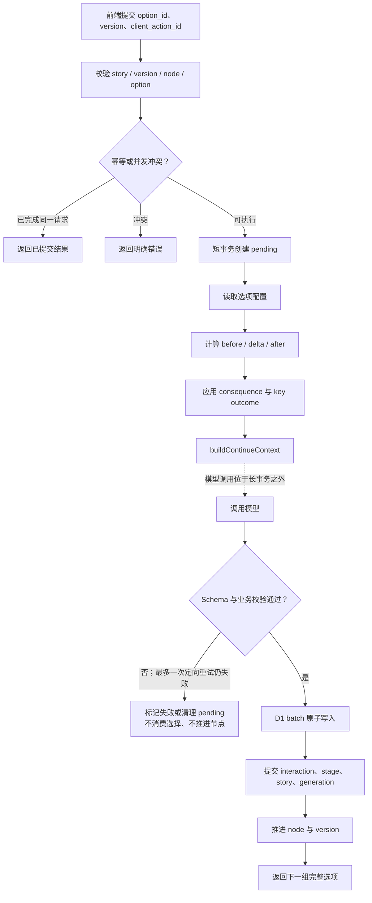

# AI 个性化互动故事板块建设复盘

本文面向产品、设计、开发与项目评审，复盘 AI 个性化互动故事从输入、规划、分支叙事、后端状态演算到结局和知识揭示的完整建设过程。所有“已实现”“已验证”和量化结论都以当前仓库、测试命令或本次工作会话中的真实模型验收记录为依据；无法由现有证据支持的数据明确标记为“当前证据不足”。

## 1. 项目背景与目标

项目希望把用户在 M2 输入的“对自己最重要的一件事”转化为一条与太空碎片风险相关、可以被用户选择改变、又能在最后完成科普回扣的个性化故事。它不是普通聊天：故事必须与既有材料、任务、轨道事件和清理玩法共存，同时不能让模型任意修改游戏状态或决定结局。

建设目标最终收敛为五点：

1. 以用户真实输入为情感锚点，生成固定且不可变的故事蓝图。
2. 用 `node_01` 至 `node_10` 组织连续叙事，并在 `node_02` 至 `node_08` 提供真实的 3 或 4 个选项。
3. 由后端维护数值状态、后果、关键结果、节点、版本和结局规则，模型只负责叙事表达。
4. 每个叙事节点使用独立模型请求，以结构化 handoff 保持连续性，避免完整对话历史持续污染上下文。
5. 在故事完成后，将故事中的异常映射为结构化太空碎片知识，而不泄露隐藏事实或内部数值。

这一目标形成了清晰的职责边界：用户拥有选择权，后端拥有事实与状态决定权，模型拥有语言表达权，前端拥有展示与交互权。

## 2. 最终成果概览

当前代码层已经形成一套单一故事引擎，没有新增第二套模型客户端、数据库层或 Prompt 管理系统。下面的数据均来自 2026-07-30 的仓库审计与测试。

| 维度 | 当前结果 | 证据与口径 |
|---|---:|---|
| 故事节点 | 10 个 | Outline Prompt 固定 `node_01` 至 `node_10` |
| 无重试时模型阶段请求 | 11 次/完整故事 | Outline 1 次 + 10 个叙事节点 |
| 互动节点 | 7 个 | `node_02` 至 `node_08` |
| 节点选项 | 共 24 个，单节点 3–4 个 | [`story-options.js`](../functions/_story/config/story-options.js) |
| 理论选择路径 | 5,184 条 | `3×4×4×3×4×3×3`，由 [`ending-reachability.js`](../functions/_story/ending-reachability.js) 穷举 |
| 状态指标 | 3 个，均为 0–100 整数 | `event_integrity`、`relationship_connection`、`uncertainty` |
| consequence 类型 | 6 个 | [`story-options.js`](../functions/_story/config/story-options.js) |
| 可达结局 | 每个 Outline 4–5 个，且恰好一个 fallback | Outline Schema 与 [`validators.js`](../functions/_story/validators.js) |
| 活跃 Prompt | 6 个 | System、Outline、Opening、Continue/Branch、Ending、Knowledge |
| Structured Output Schema | 5 个 | Continue 与 Branch 共享一个 Schema |
| 故事专项自动化测试 | 51/51 通过 | `npm run test:story`，0 失败、0 跳过 |
| 全部已执行自动化测试 | 88/88 通过 | 故事 51 + 其他 37，0 失败、0 跳过 |
| 真实模型完整路线 | 2 条到达 `node_10` | 本次工作会话验收样本；原始私密正文未保留 |
| 第四选项真实提交 | 已验证 | 第二条路线在 `node_03`、`node_04`、`node_06` 选择第四项 |

当前没有发现由故事代码本身造成的已知阻塞错误，但远程部署仍有明确前置条件：远程 D1 ID 仍是占位值、远程迁移未执行、部署环境需要安全配置 `OPENAI_API_KEY`。

## 3. 建设过程时间线

Git 只能确认最初 AI 板块提交 `28ba09f` 的日期为 2026-07-28；后续 v0.4 与数值状态 v2 仍处于未提交工作区，因此以下按可验证的阶段顺序复原，不伪造具体日期。

| 阶段 | 目标与主要工作 | 关键产物 | 问题或变化 | 最终决策与后续影响 |
|---|---|---|---|---|
| 1. 用户输入 | 把姓名、城市、重要事件与卫星上下文接入故事 | M2 输入与 `story_user_input` | 自由输入可能包含模型指令式文本 | 后端按数据序列化，Prompt 明确其仅为素材 |
| 2. System 与 Outline | 建立故事世界、情感锚点和异常机制 | System Prompt、Outline Prompt/Schema | 初版节点与结局条件较宽泛 | 固定 10 节点，结局改为结构化 `state_rule` |
| 3. Opening | 从固定大纲生成第一段正文 | Opening 服务、Schema、持久化 | 初版允许模型返回状态补丁 | Opening 收敛为正文、已知事实增量和 handoff |
| 4. Continue/Branch | 让每次选择产生后续叙事 | Continue Prompt/Schema、选项配置 | 按钮文案与叙事后果混用会产生机械复述 | 用稳定 `option_id` 与 `effect_summary` 分离 UI 和叙事 |
| 5. 重复问题识别 | 处理多轮上下文复述、模板转折 | 当前 Prompt 约束与上下文构建器 | 仓库没有保存旧/新 A/B 样本，无法量化下降比例 | 不传完整历史，每节点独立请求 |
| 6. 独立模型请求 | 保持同一故事但隔离模型上下文 | `story_id` + `continuity_handoff` | 无模型侧长会话可依赖 | 连续性完全由后端结构化数据重建 |
| 7. Continue 文风优化 | 稳定第二人称、减少“AI 味” | Continue Prompt 的节奏、自检与禁用表达 | Luna 偶尔低于 350 字 | 业务校验后仅允许一次定向重试 |
| 8. Ending 优化 | 完成承诺、细节和情绪收束 | Ending Prompt、后端结局选择器 | 模型自行选结局不可复现 | 后端先选唯一结局，模型只写正文并回显 ID |
| 9. Knowledge 分块 | 降低长段科普阅读负担 | 标题、故事连接、因果链、现实说明 | 旧单字段不利于卡片展示 | 新流程不再依赖 `knowledge_text` |
| 10. 数值状态迁移 | 替换 POSITIVE/PARTIAL/NEGATIVE 三档 | 三指标、`state_delta`、迁移 0003 | 标签无法表达混合后果 | 后端逐字段累加并 clamp 到 0–100 |
| 11. 动态选项 | 保留节点真实的 3/4 项 | 7 节点、24 项配置 | 固定取前三项会丢失第四项 | 前后端遍历真实数组，不截断、不补齐、不重排 |
| 12. 结局规则引擎 | 让所有结局可执行、可追踪 | priority、条件、consequence、fallback | 规则可能不可达或互相遮蔽 | Outline 后进行 5,184 路径可达性分析 |
| 13. 可靠性机制 | 处理重复、并发、失败和半提交 | pending、版本、幂等键、原子 D1 batch | 模型调用不能置于长事务 | 先短暂占位，模型调用后再一次性提交 |
| 14. 前后端接入 | 完成创建、恢复、选择、Ending、Knowledge 展示 | 3 个故事 API、Zustand 快照、AIStoryRail | 前端不能成为状态真相源 | 前端仅提交 `option_id` 和版本，不计算数值 |
| 15. 验证 | 覆盖规则、失败回滚、构建和真实路线 | 88 个自动化用例、两条真实模型路线 | 缺少生产延迟、成本与浏览器完整 E2E | 将其列为发布前补充证据，而非宣称完成 |

初始提交 `28ba09f` 包含 43 个文件、Git 统计为新增 3,580 行、删除 130 行。当前 v0.4/v2 增量尚未形成独立提交，不能从 Git 给出可靠日期；本报告将其与初始提交分开统计。

## 4. 初始方案与关键问题

最初方案已经完成了 AI 故事从输入到 Opening 的基本闭环，但状态边界与长线互动的可复现性不足。当前仓库中的历史文档和 Git 版本显示，初版允许模型返回 `story_state_patch`，后端再应用模型给出的指标变化、事实、线索与后果；Outline 也使用自然语言 `condition_hint` 描述结局条件。

### 4.1 多轮上下文与叙事重复

“同一 Chat 连续生成容易复述、建立新 Chat 后改善”是需求与建设过程中的设计观察，但仓库没有保留可复算的 A/B 对照日志，因此不能给出重复率下降百分比。当前架构对该问题的工程回应是：

- 同一 `story_id` 从创建到完成持续存在；
- 每个节点都发起独立 Chat Completions 请求；
- 不传完整故事正文、聊天历史、previous response ID；
- 只传当前节点、已选择后果、状态转移、上一节点 handoff、必要故事锚点和用户已知事实。

实测 fixture 中一次 Continue 输入只有 6 个顶层对象，序列化后为 1,221 个 JavaScript 字符、2,075 个 UTF-8 字节。由于没有旧版完整历史载荷样本，无法可靠计算压缩比例。

### 4.2 Continue 的结构与文风

建设中关注的风险包括段落结构重复、每段强行转折、否定式对照句、评价式模糊描写、第二/第三人称混用、上一节点复述，以及模型越权判断状态。当前 Continue Prompt 通过以下约束收敛：

- 当前节点目标优先，`previous_handoff` 只作为起点；
- 每次只突出一个主要变化；
- 不要求每段都产生冲突；
- 用动作、停顿、呼吸和具体对白表达情绪；
- 禁止用模板化否定式对照替代具体叙事；
- 输出前自检字数、人称、连续性和字段边界；
- 模型不返回数值变化、后果 ID、节点推进或结局判定。

在两条真实路线样本中，最终 Continue 长度为 354–470 个中文字符，第二人称保持稳定，没有发现完全相同段落；但 14 个 Continue/Branch 阶段中有 4 次首轮低于 350 字并触发一次重试。这只能说明当前样本的行为，不等同于线上质量率。

### 4.3 Ending 收束

初版风险是“流程结束但没有情感完成”：关键承诺可能只用概括句带过，重要物件没有具体交代，模型还可能自行挑选最顺手的结局。当前方案由后端先执行 `state_rule`，只向模型传递：

```json
{
  "selected_ending": {
    "ending_id": "...",
    "outcome": "..."
  }
}
```

Ending Prompt 要求回收未完成线索、具体交代重要对话或物件、加入即时情绪反应。模型回传的 `selected_ending_id` 必须与后端结果相同，否则验证失败且不提交。

### 4.4 Knowledge Reveal 展示

旧的单段 `knowledge_text` 不利于阅读和前端布局。当前输出改为：

- `knowledge_title`
- `story_connection`
- 3–5 项 `causal_chain`
- `reality_note`
- `story_completed: true`

它先指出故事内的具体现象，再解释从轨道环境风险到服务短暂偏差的因果链，最后说明现实影响通常局部、短暂且不一致，避免把虚构事故写成现实事实。

### 4.5 三档结果的局限

`POSITIVE`、`PARTIAL`、`NEGATIVE` 只能表达单一等级，无法描述“事件完整性提高、关系受损、不确定性下降”这类混合结果。新流程彻底停止依赖 `interaction_result`，改用三个独立指标：

| 指标 | 业务含义 | 范围 |
|---|---|---:|
| `event_integrity` | 用户重要事件及不可替代部分保留得多完整 | 0–100 整数 |
| `relationship_connection` | 人物之间的协作、理解和连接程度 | 0–100 整数 |
| `uncertainty` | 关键事实、信号和行动结果仍有多不确定 | 0–100 整数 |

每个选项的 delta 来自受版本控制的配置，而不是模型临时判断。后端计算 `after = clamp(before + delta, 0, 100)`，并把最终数值与 consequence 一起交给结局规则引擎。

## 5. Prompt 和叙事策略演进

运行时没有使用 OpenAI Platform 远程 Prompt ID，也没有引入第二套 Prompt 管理方式。规范源文件由生成脚本合并为运行时资源，再由同一个模型封装加载。

| Prompt | 运行时用途 | 主要输入 | 关键边界 |
|---|---|---|---|
| System | 所有模型阶段共享 | 当前任务的 user prompt | 定义职责、安全与叙事总原则 |
| Outline | 创建不可变蓝图 | `story_user_input` | 只规划，不写正文；生成结构化结局规则 |
| Opening | 生成 `node_01` | `story_outline` | 只返回正文、已知事实增量和 handoff |
| Continue/Branch | 生成 `node_02`–`node_08` | `continue_context` | 不修改状态，不决定节点与结局 |
| Ending | 生成 `node_09` | `ending_context` | 只写后端已选结局 |
| Knowledge | 生成 `node_10` | `knowledge_context` | 只解释主要异常，不继续剧情 |

Prompt 和 Schema 的真实加载路径是：

1. 规范源位于 [`space_debris_outline_opening_v0.4`](space_debris_outline_opening_v0.4/) 与 [`story_prompts_backend_bundle_v2_numeric_state`](story_prompts_backend_bundle_v2_numeric_state/)。
2. [`generate-story-spec-assets.mjs`](../scripts/generate-story-spec-assets.mjs) 生成 [`spec-assets.generated.js`](../functions/_story/spec-assets.generated.js)。
3. [`spec-assets.js`](../functions/_story/spec-assets.js) 按任务选择模板和 JSON Schema。
4. [`model.js`](../functions/_story/model.js) 加载 System Prompt、渲染变量，并以 `json_schema` 响应格式调用模型。

当前默认模型是 `gpt-5.6-luna`，默认 reasoning effort 与 verbosity 均为 `medium`。模型、推理强度、verbosity、超时和网络重试都可由环境变量覆盖；API Key 只从部署环境读取，仓库中未发现真实 Key。

## 6. 系统总体架构

故事运行由一个后端服务协调，前端不直接调用 OpenAI，也不持有内部状态真相。


一次完整故事在没有业务重试时包含 11 次模型阶段请求：一次 Outline，以及 `node_01` 至 `node_10` 的十次叙事请求。模型请求彼此独立，只包含 System Prompt 和当前阶段单个 user prompt；代码没有传递历史 `messages` 或 previous response ID。

这里要区分两种“会话”：

- **故事会话**：由 `story_id`、持久化节点、版本、状态、阶段输出和 handoff 维持。
- **模型会话**：每个节点都是独立请求，请求结束后不依赖模型侧历史。

这种分离牺牲了模型自动记忆完整上文的便利，换取可控输入、较低的上下文污染风险和更容易复现的状态流。

## 7. 后端状态与数据汇总机制

[`story-service.js`](../functions/_story/story-service.js) 是流程编排中心；[`state-reducer.js`](../functions/_story/state-reducer.js) 负责纯状态计算；[`repository.js`](../functions/_story/repository.js) 负责内存开发模式与 D1 持久化。

### 7.1 Outline 的拆分与持久化

Outline 输出被作为不可变快照存入 story session，其中包含：

- `event_anchor` 和 `primary_anomaly`，构成精简 `story_context`；
- 正好 10 个 `story_nodes`，作为每阶段目标；
- `initial_story_state`，仅用于创建可变 runtime `story_state`；
- 4–5 个 `reachable_endings`；
- 只在后端持有的 `hidden_facts`；
- 每个结局可执行的 `state_rule`。

运行时状态由 `createRuntimeStoryState()` 深拷贝创建。后续选择只修改 runtime state，绝不反写 Outline。

### 7.2 Opening 状态处理

Opening 获得经过验证的 Outline，返回 `story_text`、`known_to_user_additions` 和 `continuity_handoff`。后端只把新增事实合并去重到 `known_to_user`，保存 handoff，并将节点从 `node_01` 推进到 `node_02`；三个数值、active consequences、hidden facts 和 last action 保持不变。

### 7.3 选项状态转移

用户提交稳定 `option_id` 后，后端从当前节点配置读取：

```ts
{
  state_delta,
  add_consequence_ids,
  resolve_consequence_ids,
  key_outcome,
  effect_summary
}
```

`applyStoryOption()` 逐字段计算 before/delta/after，consequence 采用集合语义去重，并记录新增、解除和 key outcome。模型既不能修改 delta，也不能返回 consequence ID。

### 7.4 持久化规模

当前有 4 个迁移文件。本地 D1 应用完迁移后包含 4 张故事表、69 个字段：

| 表 | 字段数 | 作用 |
|---|---:|---|
| `story_sessions` | 20 | Outline、当前节点、版本、runtime state、最终结果 |
| `story_stages` | 16 | 各节点正文、handoff、已知事实增量、模型元数据 |
| `story_interactions` | 17 | 选项、before/delta/after、consequence、key outcome |
| `story_generations` | 16 | pending、幂等、请求指纹、失败与生成中间状态 |

初始迁移有 3 张表、38 个字段；后续迁移增加 1 张表及 31 个字段。数字来自本地 D1 `PRAGMA table_info`，不是生产数据库状态。

## 8. 各阶段输入输出设计

每个 context builder 都先从数据库与受版本控制配置聚合数据，再用 Zod 检查内部输入；模型输出随后还会同时经过 JSON Schema 与业务规则校验。

### 8.1 Continue Context Builder

[`buildContinueContext()`](../functions/_story/story-context.js) 只构造 6 个顶层对象：

| 字段 | 来源与处理 | 持久化 | 传模型 | 返前端 |
|---|---|---:|---:|---:|
| `current_node` | 不可变 Outline 中当前节点 | 是 | 是 | 否 |
| `selected_option_effect` | 配置中的 `option_id` 与 `effect_summary` | interaction | 是 | effect summary 另行公开 |
| `state_transition.before` | 选择前 runtime state | interaction | 是 | 否 |
| `state_transition.delta` | 选项配置 | interaction | 是 | 否 |
| `state_transition.after` | 后端 clamp 计算 | interaction/session | 是 | 否 |
| `active_consequences` | after state 的 ID 转为受控描述 | session | 是 | 否 |
| `previous_handoff` | 最近叙事阶段输出 | stage | 是 | 否 |
| `story_context` | core event、不可替代部分、主要异常 | Outline | 是 | 否 |
| `known_to_user` | runtime state，标准化并去重 | session/stage | 是 | 不直接公开 |

它明确不传完整历史正文、按钮 label、三档结果、聊天历史、previous response ID 或 Ending 候选规则。fixture 实测为 1,221 字符、2,075 字节；没有旧载荷样本，因此不能计算压缩百分比。

### 8.2 Ending Context Builder

[`buildEndingContext()`](../functions/_story/story-context.js) 构造 8 个顶层对象：

- `current_node`
- `selected_ending`
- `previous_handoff`
- `story_context`
- `story_state`（仅三个指标）
- `active_consequences`
- `key_outcomes`
- `known_to_user`

后端先由 [`selectEnding()`](../functions/_story/ending-selector.js) 评估全部规则，只把命中的一个 `ending_id` 和 `outcome` 传给模型。这样既避免模型从候选中主观选择，也减少 Prompt 暴露无关分支。

### 8.3 Knowledge Context Builder

[`buildKnowledgeContext()`](../functions/_story/story-context.js) 构造 6 个顶层对象：

- `current_node`
- `primary_anomaly`
- 与主要异常相关的 `hidden_facts`
- `ending_summary`
- `next_node_context`
- `story_anomaly_effects`

`story_anomaly_effects` 从已生成阶段中提炼与主要异常有关的实际表现。Knowledge 不读取数值状态，因为它的任务是解释异常因果，而不是给玩家评分；hidden facts 只在模型输入中按异常相关性过滤使用，从不进入公开 DTO。

## 9. 选项、数值和 consequence 机制

七个互动节点的真实配置如下。前端与后端都按数组原样处理，不截断第四项、不补齐、不重排，也不使用数组下标作为身份。

| 节点 | 选项数 | 稳定 option ID 数 | 说明 |
|---|---:|---:|---|
| `node_02` | 3 | 3 | 保护、协作、确认三种侧重 |
| `node_03` | 4 | 4 | 含可逆备份路径 |
| `node_04` | 4 | 4 | 首个 Branch，策略差异明显 |
| `node_05` | 3 | 3 | 修补、协调或接受缺口 |
| `node_06` | 4 | 4 | 第二个 Branch，含不可逆取舍 |
| `node_07` | 3 | 3 | 最终细节、共同责任或保留变化 |
| `node_08` | 3 | 3 | 完成方式并进入 Ending |

每个选项同时包含三个数值 delta、consequence 增删、key outcome 和 effect summary。label 面向用户表达操作，effect summary 面向模型表达“这个操作在故事世界里造成什么后果”，防止模型机械复述按钮。

当前 consequence 生命周期审计如下：

| ID | 主要作用 | 有新增路径 | 有解除路径 | 当前判断 |
|---|---|---:|---:|---|
| `core_item_secured` | 核心物件或不可替代部分得到保护 | 是 | 否 | 设计为持久正向事实，需策划确认 |
| `time_window_compressed` | 时间窗口被压缩 | 是 | 是 | 生命周期完整 |
| `coordination_strain` | 协作关系承压 | 是 | 是 | 生命周期完整 |
| `unclear_signal` | 信号或信息仍不清楚 | 是 | 是 | 生命周期完整 |
| `shared_plan` | 形成共同计划 | 是 | 否 | 设计为持久正向事实，需策划确认 |
| `visible_irreplaceable_loss` | 不可替代部分出现可见损失 | 是 | 否 | 严重持久后果，需策划确认 |

“没有解除路径”不是代码错误，但属于内容规则，需要策划确认其是否确实应永久影响结局。

## 10. Ending 规则引擎

每个结局拥有 `priority`、数值 `conditions`、`required_consequence_ids`、`forbidden_consequence_ids` 和 `fallback`。Outline 校验要求每个故事恰好一个 fallback，fallback 不得包含任何条件。

规则执行顺序为：

1. 排除 fallback，逐条检查数值条件与 consequence 前置/禁止条件。
2. 多条同时命中时，先按 `priority` 降序。
3. 同优先级时，条件约束数量更多者优先。
4. 仍相同时保持 Outline 原始顺序。
5. 没有普通规则命中时使用唯一 fallback。

选择器会产生详细 trace，包括每项条件的实际值与是否匹配、缺失的 required consequence、出现的 forbidden consequence。该 trace 可持久化审计，但不传模型或前端。

[`analyzeEndingReachability()`](../functions/_story/ending-reachability.js) 穷举 5,184 条真实选项路径，检查每个非 fallback 结局至少可被一条路径选中，并检查规则是否被高优先级规则完全遮蔽。该方法对当前 7 个节点很有效，但路径数量随图扩张呈指数增长，未来增加更多节点或选项时需要考虑符号求解或采样策略。

## 11. Knowledge Reveal 设计

Knowledge 是故事完成后的解释层，不是新的故事分支。它将“故事里发生了什么”与“现实中这种太空环境风险可能怎样造成局部、短暂影响”连接起来。

结构化 Schema 要求：

| 字段 | 作用 | 约束 |
|---|---|---|
| `knowledge_title` | 知识卡标题 | 简短、聚焦主要异常 |
| `story_connection` | 指出故事中的具体异常及影响 | 1–2 句 |
| `causal_chain` | 连续解释风险到故事影响 | 3–5 项，每项标题与正文 |
| `reality_note` | 提醒现实影响边界 | 1–2 句，避免夸大 |
| `story_completed` | 标记流程完成 | 固定为 `true` |

Knowledge 只使用与 `primary_anomaly` 直接相关的 hidden facts，避免把所有隐藏设定倾倒给模型。前端 [`AIStoryRail.jsx`](../src/components/AIStoryRail.jsx) 按字段分块展示，不依赖旧的单字段 `knowledge_text`。

## 12. 工程可靠性设计

一次选择既包含确定性的状态计算，也包含不确定、耗时的模型调用。系统通过 pending claim、幂等和最终原子提交将二者分开。



可靠性机制包括：

- `client_action_id`：相同客户端操作重试复用同一 ID，防止重复消费。
- 请求指纹与幂等键：同一故事中重复动作返回已有结果或明确冲突。
- `version`：乐观并发控制，两个请求不能同时消费同一版本。
- `story_generations` pending：在模型调用前占据 `(story_id, expected_version)`。
- 一次定向重试：首次输出未通过解析、Schema 或业务校验时，只反馈简明失败原因并重试一次。
- 原子提交：常规选择最终 batch 写入 interaction、1 个 stage、session 与 generation，共 4 条语句；`node_08` 会一起提交 Continue、Ending、Knowledge 三个 stage，共 6 条语句。
- 失败回滚：模型失败、解析失败或第二次校验失败时不写入公开阶段、不更新 session、不推进节点和版本。

在 `node_08`，已验证的 Ending 输出暂存于 generation 私有数据，只有 Knowledge 也成功后才整体公开提交。因此不会出现“结局已保存、Knowledge 失败但用户选择已被消费”的半完成状态。

```mermaid
flowchart LR
    subgraph BE["后端负责"]
      B1["node / option"]
      B2["state / delta / clamp"]
      B3["consequence / key outcome"]
      B4["ending rule / version"]
      B5["pending / idempotency / persistence"]
    end
    subgraph AI["模型负责"]
      A1["Opening / Continue 正文"]
      A2["Ending 正文"]
      A3["Knowledge 文案"]
      A4["continuity handoff"]
      A5["known facts additions"]
    end
    subgraph FE["前端负责"]
      F1["展示故事和 3/4 个选项"]
      F2["提交稳定 option_id"]
      F3["展示 Ending"]
      F4["展示 Knowledge 分块"]
      F5["不计算内部状态"]
    end
    BE -->|"构造受控上下文"| AI
    AI -->|"结构化输出；不得改状态"| BE
    BE -->|"只返回 public DTO"| FE
    FE -->|"版本化用户操作"| BE
```



## 13. 策略创新点

这些机制不是孤立功能，而是针对个性化叙事的可控性、连续性和可验证性问题形成的组合设计。

| 原问题 | 设计决策 | 实现方式 | 效果 | 已知代价或限制 |
|---|---|---|---|---|
| 长对话污染、复述 | 故事会话与模型会话分离 | 同一 story 持久化；节点独立请求 | 上下文边界清晰，便于复现 | 必须维护高质量 handoff |
| 模型篡改事实与状态 | 叙事与状态解耦 | 后端计算，模型仅写文字 | 状态可测试、可审计 | 内容配置工作转移到后端/策划 |
| 三档标签过粗 | 真实三维数值状态 | 独立 delta 与 clamp | 支持混合结果和细微差异 | 阈值与 delta 需持续调参 |
| 按钮文案不适合叙事 | 选项级 effect summary | label 与 effect summary 分离 | 用户操作和故事后果各自自然 | 每项需要人工内容审核 |
| 模型主观挑结局 | 结构化结局规则 | priority、条件、consequence、fallback | 同状态必得同结局，可追踪 | 路径穷举随规模指数增长 |
| 固定三选项丢失内容 | 3/4 项动态保留 | 遍历真实配置，稳定 ID | 支持差异化互动密度 | 前端布局需兼容不同数量 |
| 模型失败造成半提交 | 选择级原子提交 | pending、version、幂等、D1 batch | 失败不消费选择 | 实现与恢复逻辑更复杂 |
| 长段科普阅读负担 | Knowledge 分块 | connection、chain、reality note | 更适合卡片化扫描阅读 | 需要前端维护结构化布局 |

## 14. 测试体系与验证结果

测试按风险而不是按文件罗列。故事专项共 5 个测试文件、51 个用例；前端 timeline 测试 1 个文件。风险分类可能交叉，因此分类数量不能简单相加为总数。

| 风险类别 | 测试方法与代表证据 | 直接相关用例/场景 | 结果 | 尚未覆盖 |
|---|---|---:|---|---|
| 基础流程 | 创建故事、Opening→node02、推进、version、timeline | 多个集成用例 | 通过 | 真实浏览器全流程 |
| 状态正确性 | before/delta/after、连续累加、clamp | 1 个边界用例含 3 组数值场景 | 通过 | 大规模随机属性测试 |
| 选项完整性 | 3/4 数量、顺序、第四项真实提交、非法数量 | 至少 2 个直接风险用例 | 通过 | 所有 24 项逐项文案验收 |
| 数据一致性 | known facts 去重、consequence 增删、key outcomes | 服务与 numeric 测试 | 通过 | 生产恢复演练 |
| 稳定性 | 同 session 幂等、跨 session 冲突、client action、并发 | 3 个幂等直接测试、1 个并发直接测试 | 通过 | 多实例压力测试 |
| 模型失败 | Schema/业务失败、一次重试、失败不提交 | model/service 测试 | 通过 | 真实供应商长时间故障 |
| Ending | priority、并列消解、required/forbidden、fallback、错误 ID | 约 7 个交叉用例 | 通过 | 策划规则长期平衡性 |
| Knowledge | 结构化输出、相关 hidden facts、失败回滚、前端展示 | 4 个直接风险用例 | 通过 | 可用性与阅读理解研究 |
| 工程 | lint、build、D1 migration、health、diff check | 命令级验证 | 通过，有 1 类构建警告 | 远程 D1、生产 smoke |

本次重新执行结果：

- `npm run test:story`：51 通过、0 失败、0 跳过，耗时 7,718.6314 ms。
- 其余仓库测试：37 通过、0 失败、0 跳过，耗时 243.5156 ms。
- 合计：88 通过、0 失败、0 跳过。
- ESLint：通过。
- Vite 生产构建：通过，转换 2,780 个模块，耗时 1.68 秒。
- 本地后端健康检查：HTTP 200，`ok: true`，持久化模式为 `memory-dev-only`。
- 本地 D1 迁移：`No migrations to apply`，0004 字段已由 `PRAGMA table_info` 确认。
- `git diff --check`：通过，仅输出 Git 的 LF/CRLF 工作区换行警告。

真实模型验收完成两条 `node_01` 至 `node_10` 路线。其中一条命中普通结局，另一条命中 fallback；第二条路线实际选择了三个不同节点的第四项。22 个阶段生成任务共发生 29 次模型调用，其中 7 次为定向重试：该两故事样本的首轮阶段通过率为 15/22（68.2%），重试发生率为 7/22（31.8%）。这只是本次验收样本，不是生产成功率。

两条路线中没有观察到 JSON 解析或 JSON Schema 失败；7 次重试均来自业务规则，其中 4 次是 Continue 少于 350 字、1 次是 Opening 少于长度要求、2 次是 Outline 结局可达性失败。第二次均通过，但样本量不足以评价长期稳定性。

## 15. 量化成果

量化数据按来源分为 Git 统计、当前代码静态统计、自动化实测和真实模型验收样本，避免把不同口径混为一谈。

### 15.1 代码、资源和迁移

| 指标 | 数值 | 来源与统计范围 |
|---|---:|---|
| 初始 AI 板块提交 | 43 文件，+3,580/-130 行 | `git show --stat/--numstat 28ba09f` |
| 初始提交命名函数/类声明匹配 | 91 个 | 对该提交新增行执行函数/类/exported-arrow 模式匹配；涵盖整个初始 AI 板块 |
| 当前故事后端运行时 | 31 个 JS 文件、4,650 物理行 | `functions/_story/`，含生成资源和产品动作配置 |
| 故事 API | 3 个文件 | 创建、读取、提交 action |
| 直接前端集成 | 6 个文件、2,080 物理行 | AIStoryRail、服务、timeline、store、M3；M3 同时含非故事 UI |
| 核心代码文件 | 40 个 | 31 后端 + 3 API + 6 直接前端；本报告采用的明确口径 |
| 活跃 Prompt | 6 个 | System + 5 个阶段 Prompt |
| Structured Output Schema | 5 个 | Outline、Opening、Continue/Branch、Ending、Knowledge |
| 内部 Zod Schema | 19 个导出、20 个定义 | [`schemas.js`](../functions/_story/schemas.js) 静态统计 |
| 数据库迁移 | 4 个 | [`migrations`](../migrations/) |
| 直接故事测试文件 | 6 个、1,341 物理行 | 5 后端 + 1 timeline |
| 当前选定故事范围未提交增量 | 20 个 tracked 文件 +2,266/-1,008 行；18 个 untracked 文件 3,158 物理行 | tracked 用 Git numstat；untracked 用文件物理行，两个口径未直接相加为净变更 |

当前选定故事范围的“毛新增规模”可描述为 5,424 行：2,266 行 tracked 新增 + 3,158 行 untracked 物理行。它只是估算工作量的混合口径，不等于最终净代码量，也不应与初始提交 3,580 行直接相加。

### 15.2 节点与状态规模

| 指标 | 数值 | 来源 |
|---|---:|---|
| 故事节点 | 10 | Outline Prompt/Schema |
| Continue 节点 | 5 | node02、03、05、07、08 |
| Branch 节点 | 2 | node04、06 |
| Ending / Knowledge | 各 1 | node09、10 |
| 状态指标 | 3 | state reducer |
| consequence | 6 | option config |
| 选项总数 | 24 | 7 个节点配置 |
| 选项范围 | 3–4/节点 | option config |
| 可达结局范围 | 4–5 | Outline Schema |
| 选择路径 | 5,184 | 选项数乘积，代码全量枚举 |
| 常规最终原子写入 | 4 条 D1 语句 | repository commit |
| node08 最终原子写入 | 6 条 D1 语句 | interaction + 3 stages + session + generation |

### 15.3 无法可靠量化的数据

当前证据不足以可靠给出：

- 新旧上下文输入体积减少百分比，因为没有旧版 payload 样本；
- 生产平均/中位生成延迟，因为真实验收临时记录未保留完整时序；
- Token 总量与成本，因为仓库没有持久聚合日志；
- 线上首轮成功率、重试率和故障率，因为只有两条验收路线；
- 叙事重复下降比例或“AI 味”下降比例，因为没有可复算 A/B 语料与评价标准；
- 新增函数的精确净数量，因为 v0.4/v2 仍处在包含其他工作区改动的未提交状态。

## 16. 最终效果评估

最终效果需要区分代码层保证、自动化测试覆盖和真实样本观察，不能把三者混写成同一种“已验证”。

### 16.1 用户体验

代码层保证用户每一步看到当前节点真实的 3 或 4 个选项，并以稳定 `option_id` 提交；选择会改变三维状态、consequence 和 key outcomes，从而影响后端结局。前端只接收公开快照，不展示内部数值、hidden facts 或规则 trace。Knowledge 分块已经接入前端，但尚缺少正式用户可用性测试。

### 16.2 叙事质量

两条真实验收路线均连续到达 node10，第二人称稳定，没有完全重复段落；Continue 最终长度为 354–470 字，Ending 为 582/602 字，Knowledge 为 432/440 字。Ending 样本分别覆盖普通结局与 fallback。仍有 4 次 Continue 首轮过短，说明长度遵从仍需监控；“转折句减少”“情绪更具体”只有小样本人工观察，不具备统计结论。

### 16.3 工程可靠性

自动化测试证明了当前实现对幂等、并发、pending、状态边界、错误 ending ID 和失败不提交等风险的预期行为。模型调用不处于长 D1 事务内，最终状态与正文一起原子写入。真实供应商故障、多实例压力和灾难恢复尚未验证。

### 16.4 可扩展性

- 新异常类型：需要扩展 Outline 枚举、事实过滤、Knowledge Prompt/Schema 与测试。
- 新节点：需要更新 Outline 合同、选项配置、状态推进与路径分析；当前穷举可能成为瓶颈。
- 新 consequence：需要配置定义、选项增删路径、Schema 白名单和结局规则测试。
- 新模型：模型封装可通过环境变量切换，职责边界与 Schema 可保持不变，但需重新做真实输出验收。
- 多 Agent：可以在未来拆分规划、叙事或审校，但必须继续由同一后端状态机仲裁，不能建立第二套故事真相源。
- 新前端形式：只要消费 public DTO，可替换呈现层而不暴露内部状态。

## 17. 已知问题与后续计划

发布前事项按优先级和是否阻塞上线列出。这里的“阻塞”指生产部署条件，而不是本地故事代码是否可运行。

| 事项 | 当前状态与风险 | 建议动作 | 优先级 | 阻塞上线 |
|---|---|---|---:|---:|
| 远程 D1 ID | `wrangler.toml` 仍为全零占位 ID | 由部署负责人填写真实数据库绑定 | P0 | 是 |
| 远程 D1 迁移 | 只验证了本地，无远程迁移证据 | 备份后在目标环境执行并核对 0001–0004 | P0 | 是 |
| OpenAI Key | 代码只读环境变量，仓库无真实 Key | 在部署平台安全配置，不写入仓库 | P0 | 是 |
| 数值配置 | 24 项 delta 尚需策划平衡确认 | 逐项评审三指标取舍与结局分布 | P1 | 内容发布门槛 |
| effect summary / key outcome | 代码结构完整，文案质量仍需人工确认 | 做逐节点内容验收 | P1 | 内容发布门槛 |
| 永久 consequence | 3 个 ID 没有解除路径 | 确认其为永久事实，或补明确解除配置 | P1 | 视策划决定 |
| Luna 偶发短文 | 两条路线中 4 次 Continue 首轮短于 350 字 | 保留一次重试并增加生产质量监控 | P1 | 否 |
| 真实质量样本 | 仅 2 条完整路线 | 扩展多输入、多异常、多结局验收集 | P1 | 否 |
| 浏览器 E2E | 未执行完整用户点击与刷新恢复测试 | 上线前补 Playwright/人工浏览器验收 | P1 | 建议作为发布门槛 |
| 延迟、Token、成本 | 没有持久聚合数据 | 加隐私安全的阶段指标与预算告警 | P1 | 否 |
| `.wrangler` 产物 | `.gitignore` 已忽略，但 12 个历史产物仍被 Git 跟踪 | 单独执行 `git rm --cached` 并复查历史；本次不改 | P1 | 仓库卫生门槛 |
| 构建大 chunk | Gltf 相关 chunk 约 950.65 kB，Vite 发出 >500 kB 警告 | 懒加载或手工分包 | P2 | 否 |
| 路径穷举增长 | 当前 5,184 条可接受，扩图后指数增长 | 扩图前评估符号约束或采样 | P2 | 否 |

当前未发现真实 API Key 泄露；`.dev.vars.example` 仅含占位符，`server/.env` 被忽略且本次未读取。`.wrangler` 被跟踪属于仓库卫生风险，不等同于已经发现密钥泄露。

## 18. 总结

AI 个性化互动故事已经从“模型生成并顺带修改状态”的原型，演进为“后端维护事实与规则、模型负责阶段叙事、前端只展示公开快照”的单一可审计流程。当前实现覆盖 Outline、Opening、Continue/Branch、Ending 与 Knowledge，支持 10 节点、24 个动态选项、三维数值状态、6 种 consequence、4–5 个结构化结局，以及失败不推进的选择级原子提交。

本地证据表明 88 个自动化测试、ESLint、生产构建、本地迁移和健康检查均通过；两条真实 Luna 路线到达 node10，并覆盖真实第四选项、普通结局与 fallback。与此同时，远程 D1、部署密钥、浏览器完整 E2E、生产延迟/成本指标和策划数值验收仍未完成。结论应表述为：**代码层与本地验证已经形成可运行闭环，但生产发布仍受环境配置与内容验收门槛约束。**

## 附录 A：关键文件索引

以下索引按运行链路组织，便于交接时从入口定位职责。

| 类别 | 文件 |
|---|---|
| 服务编排 | [`story-service.js`](../functions/_story/story-service.js) |
| 状态计算 | [`state-reducer.js`](../functions/_story/state-reducer.js) |
| Context Builder | [`story-context.js`](../functions/_story/story-context.js) |
| 结局选择 | [`ending-selector.js`](../functions/_story/ending-selector.js) |
| 结局可达性 | [`ending-reachability.js`](../functions/_story/ending-reachability.js) |
| 输出验证 | [`validators.js`](../functions/_story/validators.js) |
| 数据库 Repository | [`repository.js`](../functions/_story/repository.js) |
| 公开 DTO | [`public-dto.js`](../functions/_story/public-dto.js) |
| 模型封装 | [`model.js`](../functions/_story/model.js) |
| 运行时规范选择 | [`spec-assets.js`](../functions/_story/spec-assets.js) |
| 生成的 Prompt/Schema | [`spec-assets.generated.js`](../functions/_story/spec-assets.generated.js) |
| System Prompt | [`system.js`](../functions/_story/prompts/system.js) |
| 选项配置 | [`story-options.js`](../functions/_story/config/story-options.js) |
| API 创建 | [`functions/api/stories/index.js`](../functions/api/stories/index.js) |
| API 获取 | [`functions/api/stories/[storyId].js`](../functions/api/stories/%5BstoryId%5D.js) |
| API 操作 | [`functions/api/stories/[storyId]/actions.js`](../functions/api/stories/%5BstoryId%5D/actions.js) |
| 前端故事轨 | [`AIStoryRail.jsx`](../src/components/AIStoryRail.jsx) |
| 前端服务 | [`ai.js`](../src/services/ai.js) |
| 前端状态 | [`useAppStore.js`](../src/store/useAppStore.js) |
| 初始迁移 | [`0001_story_system.sql`](../migrations/0001_story_system.sql) |
| Outline/Opening 迁移 | [`0002_outline_opening_v04.sql`](../migrations/0002_outline_opening_v04.sql) |
| 数值状态迁移 | [`0003_story_numeric_state_v2.sql`](../migrations/0003_story_numeric_state_v2.sql) |
| Ending pending 迁移 | [`0004_story_pending_ending.sql`](../migrations/0004_story_pending_ending.sql) |
| 数值故事测试 | [`numeric-story.test.mjs`](../functions/_story/numeric-story.test.mjs) |
| 服务流程测试 | [`story-service.test.mjs`](../functions/_story/story-service.test.mjs) |

## 附录 B：字段可见性矩阵

该矩阵说明哪些字段属于内部真相、哪些可进入模型上下文、哪些可以公开。

| 字段 | 存数据库 | 传模型 | 返回前端 | 仅后端使用 |
|---|---:|---:|---:|---:|
| `hidden_facts` | 是 | 仅按阶段与异常过滤 | 否 | 是 |
| `state_rule` | 是 | Outline 生成时由模型输出；后续不传 | 否 | 是 |
| `story_state` | 是 | Continue/Ending 仅传受控子集 | 否 | 是 |
| `state_delta` | interaction | Continue | 否 | 是 |
| `active_consequences` | 是 | Continue/Ending 传受控描述 | 否 | 是 |
| `key_outcomes` | 是 | Ending | 否 | 是 |
| option `label` | 配置/快照 | 否 | 是 | 否 |
| `effect_summary` | 配置/interaction | Continue | 是 | 否 |
| `continuity_handoff` | stage | 下一叙事阶段 | 否 | 是 |
| `known_to_user` | session/stage | 叙事阶段 | 不直接公开 | 是 |
| ending evaluation trace | 模型/审计元数据 | 否 | 否 | 是 |
| knowledge causal chain | stage | 由 Knowledge 模型生成 | 是 | 否 |

## 附录 C：测试命令与结果

以下命令均为只读或本地安全验证，没有修改生产密钥或远程数据库。

| 命令/检查 | 结果 |
|---|---|
| `npm.cmd run test:story` | 51 通过，0 失败，0 跳过 |
| 其余 `node --test` 测试文件 | 37 通过，0 失败，0 跳过 |
| `npm.cmd run lint` | 通过 |
| `npm.cmd run build` | 通过；2,780 模块；1 类大 chunk 警告 |
| 本地 D1 migration list | No migrations to apply |
| 本地 D1 `PRAGMA table_info` | 0004 的 `validated_ending_output_json` 已存在 |
| `GET /api/health` | HTTP 200，`ok: true`，memory-dev-only |
| `git diff --check` | 通过；仅换行风格提示 |
| 两条真实模型路线 | 均到 node10；一条普通结局、一条 fallback |

本地 migration list 首次在受限环境中因 npm 缓存权限/网络访问失败，随后以只读授权重跑成功；这属于工具运行环境问题，不是迁移本身失败。

## 附录 D：量化指标来源

量化数字的可审计性按来源分级，使用时应保留其限制。

| 指标 | 类型 | 来源 | 限制 |
|---|---|---|---|
| 43 文件、+3,580/-130 | Git 统计 | `28ba09f` | 只代表初始 AI 板块提交 |
| 31 后端/3 API/6 前端 | 代码静态统计 | 当前文件树 | 范围定义见 15.1 |
| 6 Prompt/5 Schema | 运行时静态统计 | model/spec assets | Continue 与 Branch 共享资源 |
| 10 节点/24 选项/5,184 路径 | 代码与合同推导 | Prompt、配置、reachability | 路径数为确定性乘积 |
| 4 表/69 字段 | 本地数据库实测 | D1 PRAGMA | 不代表远程生产 |
| 88/88 测试 | 自动化实测 | Node test runner | 不包含浏览器真实用户 E2E |
| 2 条真实路线 | 真实模型验收 | 本次工作会话 | 小样本，私密正文未保留 |
| 15/22 首轮通过、7/22 重试 | 真实模型验收 | 两路线 22 个阶段 | 不得外推为线上成功率 |
| 354–470 等文本长度 | 真实模型验收 | 两路线最终输出 | 只表示最终通过样本 |
| Token、成本、生产延迟 | 当前证据不足 | 无持久聚合日志 | 不估算 |
